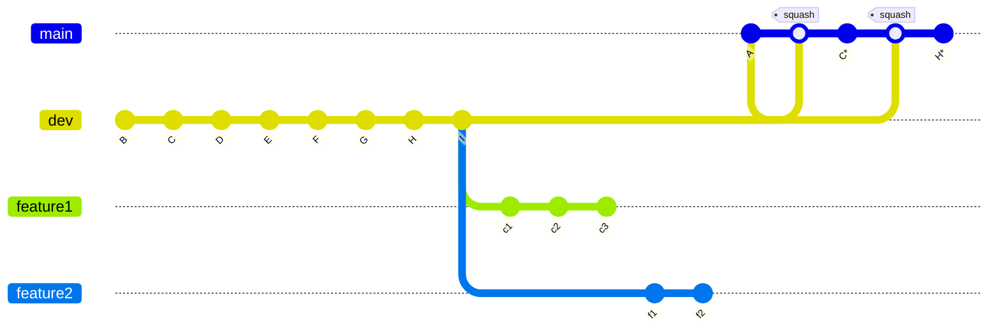

# Git 的团队协作方式

## 概要
本文是一份项目 Git 管理制度的详细流程，涵盖拉取、推送、合并等核心操作，旨在作高效协作与历史清晰。

## 一、分支管理规范

| 分支类型 | 来源分支 | 合并目标 | 主要用途 | 注意事项 |
| :-- | :-- | :-- | :-- | :-- |
| **主分支（main / master）** | - | -（最终发布） | 存放稳定、可发布代码 | 🚫 禁止直接提交代码；通过 PR 合并；由负责人维护 |
| **开发分支（dev）** | `main`（首次创建） | `main`（定期合并） | 日常开发集成，汇总功能分支 | 团队成员统一从此分支拉取最新代码 |
| **功能分支（feature/xxx）** | `dev` | `dev` | 单个功能开发 | 命名遵循 `feature/功能名称`；开发完成后合并回 `dev` |
| **修复分支（hotfix/xxx）** | `main` | `main`、`dev` | 紧急线上缺陷修复 | 命名遵循 `hotfix/缺陷编号`；修复完成后需同步回 `dev` |

## 二、代码拉取与更新流程

### 1. 拉取远程最新代码
在开发中，我们经常需要让自己的 feature 分支保持与 main 同步，以获得最新的代码、修复冲突、减少后续合并的代价。**优先使用变基拉取，保持提交历史线性**。以下是最简单、最方便的拉取合并方式：

| 操作方式     | 命令                              | 本质行为           | 历史效果        |
| -------- | ------------------------------- | -------------- | ----------- |
| 合并（多人协作） | `git pull origin main`          | fetch + merge  | 有合并提交（非线性）  |
| 变基（单人开发） | `git pull --rebase origin main` | fetch + rebase | 无合并提交（线性历史） |

:::details 复杂方式

我们还可以使用这种复杂方式 **(部分等价于上面方式)**：用 rebase 替代 merge，让提交历史更整洁。`merge` 会产生一个额外的 “合并 commit”，`rebase` 可以把你的提交 “嫁接” 到目标分支最新版本上，历史更线性。

:::code-group
``` sh [feature分支是个人开发]
# 比如在 feature 分支，想同步 main 的最新代码：

# 1. 确保本地 main 分支是最新的（先拉取主分支最新代码）
git checkout main
git pull origin main

# 2. 切回 feature 分支，用 rebase 同步 main 的修改
git checkout feature
git rebase main # 把 feature 的提交放在 main 最新提交之后

# 3. 若有冲突，解决后执行：
git add .  # 标记冲突已解决
git rebase --continue  # 继续完成 rebase，直到结束

# 4. 由于 rebase 改写了历史，需要强制推送（用 --force-with-lease 更安全）
git push --force-with-lease origin feature

# （注意：已 push 到远程的分支不要用 rebase，会打乱他人历史）
```

``` sh [feature 分支是多人协作]
# 1. 确保本地 main 分支是最新的
git checkout main
git pull origin main

# 2. 切回 feature 分支，合并 main 的修改
git checkout feature
git merge main

# 3. 若有冲突，解决后执行：
git add .
git commit -m "merge: 同步 main 分支最新代码"  # 会自动生成合并 commit，可修改提交信息

# 4. 正常推送（无需强制，因为 merge 没有改写历史，只是新增了合并 commit）
git push origin feature
```
:::

### 2. 推送最新代码

提交前执行本地测试、代码 lint 检查，确保无语法错误和风格问题。
``` bash
# 如 git push origin feature/user-login:feature/user-login
git push origin 本地分支:远程分支
```

### 3. 代码合并（Pull Request）流程

1. **发起 PR**
  - 功能 / 修复完成后，从个人分支向develop（或对应目标分支）发起 PR。
  - PR 描述需包含：功能说明、测试点、关联的需求 / 缺陷编号（如 Jira 工单）。

2. **代码评审（Code Review）**
  - 至少由 1 名团队成员（非作者）评审，关注：代码逻辑合理性、可读性等
  - 评审通过后，由作者或项目负责人执行合并。

3. **合并操作**
  - 优先使用 **squash 合并**（将多个提交压缩为一个），保持历史简洁。如：GitHub：在 PR 界面选择「Squash and Merge」；命令行则 git merge --squash 源分支，再提交合并信息。
  - 若需保留提交历史（如修复分支），可使用常规合并。

## 三、版本发布流程

1. **从 dev 合并到 main**

发布前在develop分支执行全量测试，确认无问题后发起 PR 合并到main。

2. **打标签（Tag）**

合并完成后，在main分支打版本标签，格式：v版本号（如v1.0.0）：
``` bash
git tag -a v1.0.0 -m "版本1.0.0发布，包含用户注册、登录功能"
git push origin v1.0.0
```

3. **冲突解决规范**

冲突产生场景：多人修改同一文件的同一部分，拉取或合并时触发。解决步骤：

- 本地拉取最新代码（git pull --rebase），定位冲突文件。
- 手动解决冲突（保留正确逻辑，删除冲突标记<<<<<<< ======= >>>>>>>）。
- 提交解决后的代码：`git add 冲突文件 && git rebase --continue`（若使用变基）或常规提交后推送。
- 若冲突复杂，及时与相关开发人员沟通，避免误删逻辑。

<!-- ## 四、常用技巧

### **1. 拉取最新主分支并合并** -->


## 四、小结

### 1. Git 别名与工具优化

为提升效率，可配置全局 Git 别名（如前文提到的git pr）：
``` bash
# 配置变基拉取别名
git config --global alias.pr "pull --rebase"
# 配置快速查看提交历史（简洁版）
git config --global alias.lg "log --oneline --graph --decorate --all"
```

通过以上流程，可实现团队协作中代码版本的高效管理、历史追溯与风险控制，保障项目稳定迭代。


<!-- 
## 开发与发布流程

### 1. 从 dev 创建功能分支
```bash
git checkout dev
git pull
git checkout -b feature/xxx
```

### 2. 在功能分支开发
```bash
# 编码 + 提交
git add .
git commit -m "feat: 实现功能 X"
git commit -m "fix: 修复功能 X 的 bug"
```

### 3. 合并回 dev（保留历史）
```bash
git checkout dev
git pull
git merge --no-ff feature/xxx
git push origin dev
```
合并后删除分支（可选）：
```bash
git branch -d feature/xxx
git push origin --delete feature/xxx
```
### 4. 发布版本（dev → main）
1. 在 GitHub 创建 PR

* Base: main

* Compare: dev

2. 合并方式选择 Squash and merge

3. main 上会生成一个新的单提交版本记录（hash 与 dev 不同，但代码一致）

### 5. 继续开发
* 新功能分支继续从最新 dev 切出。

* main 永远不合回 dev。

## 为什么这样不会重复提交
所有开发分支都基于 dev，dev 的历史是连续的，没有旧 hash 残留。

main 只接收来自 dev 的 squash 提交。

GitHub PR 对比基于提交差异，连续的 dev 历史不会导致重复显示已合并的提交。

## 查看历史
查看完整开发历史：
```bash
git log dev --oneline --graph --decorate
```
查看版本发布历史：
```bash
git log main --oneline
```

## 注意事项
功能分支必须从 dev 创建，禁止从 main 创建。

main 不能反向合并到 dev。

发布 PR 到 main 时只能由 dev 发起，禁止功能分支直接对 main 发 PR。

## 流程图
```
dev:      A──B──C──D──E──F──G──H──I
              \           \
feature1:      c1──c2──c3  \
                           feature2:  f1──f2

main:     A─────────C*───────────────H*
            squash      squash
```

dev：完整历史

main：版本节点（squash 提交）

C*、H*：Squash and merge 生成的新提交 -->
